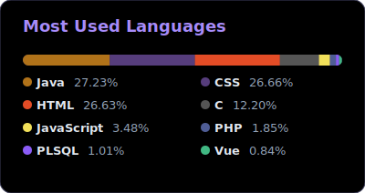

# 📊 GitHub Stats Generator

> Um gerador de estatísticas de linguagens self-hosted, rodando via GitHub Actions. Sem dependências externas, sem downtime.

<div align="center">
    </img> 
</div>

## 💡 Sobre o Projeto

Cansado de widgets de estatísticas do GitHub que vivem caindo, quebrando imagens ou atingindo limites de API, decidi criar minha própria solução.

Este projeto consiste em um script **Node.js** que consulta a API do GitHub, calcula o uso de bytes por linguagem em todos os meus repositórios públicos e gera um **SVG estático** com um tema personalizado.

Tudo isso é orquestrado pelo **GitHub Actions**, garantindo que minhas estatísticas estejam sempre atualizadas no meu perfil.

## 🎨 Design

- **Layout:** Stacked Bar Chart (Barra de progresso única).
- **Tema:** Midnight Purple (Fundo `#130f1c` com acentos Neon).
- **Cores:** Cores oficiais das linguagens (Java, Vue, JS, etc.) adaptadas para contraste em modo escuro.

## 🚀 Como Funciona

1.  **Agendamento:** Um workflow do GitHub Actions roda todos os dias às 04:00 UTC (cron).
2.  **Coleta:** O script `index.js` usa a API oficial (`Octokit`) para buscar meus repositórios.
3.  **Cálculo:** Soma os bytes de cada linguagem e calcula a porcentagem.
4.  **Geração:** Desenha um arquivo `stats.svg` localmente usando SVG puro (sem libs pesadas de imagem).
5.  **Deploy:** O Action faz o commit do novo SVG no repositório.
6.  **Cache Busting:** Um script final força a limpeza do cache de imagens do GitHub (Camo) para garantir que o perfil mostre a versão mais recente.

## 🛠️ Tecnologias Utilizadas

- **Node.js** (v18+)
- **GitHub Actions** (CI/CD)
- **@octokit/rest** (API Client)
- **SVG** (Vetorização)

## ⚙️ Instalação Local

Se quiser rodar ou modificar o script na sua máquina:

1.  **Clone o repositório:**
    ```bash
    git clone [https://github.com/TaylanHahn/my-github-stats.git](https://github.com/TaylanHahn/my-github-stats.git)
    cd my-github-stats
    ```

2.  **Instale as dependências:**
    ```bash
    npm install
    ```

3.  **Configure o Token:**
    Você precisa de um *Personal Access Token* (PAT) do GitHub para rodar localmente.
    No Linux/Mac:
    ```bash
    export MY_GITHUB_TOKEN="seu_token_aqui"
    ```
    No Windows (PowerShell):
    ```powershell
    $env:MY_GITHUB_TOKEN="seu_token_aqui"
    ```

4.  **Execute:**
    ```bash
    npm start
    # ou
    node index.js
    ```
    *O arquivo `stats.svg` será gerado na raiz do projeto.*

## 🤖 Automação (Workflow)

A automação está configurada em `.github/workflows/update-stats.yml`.

- **Cron:** `0 4 * * *` (Todo dia às 04:00).
- **Trigger Manual:** Pode ser acionado na aba "Actions" do GitHub.
- **Permissões:** O workflow possui permissão de `Read and Write` para conseguir fazer o push da imagem atualizada.


> ## 📝 Licença
>Este projeto está sob a licença MIT. Sinta-se livre para fazer um fork e criar sua própria versão!

